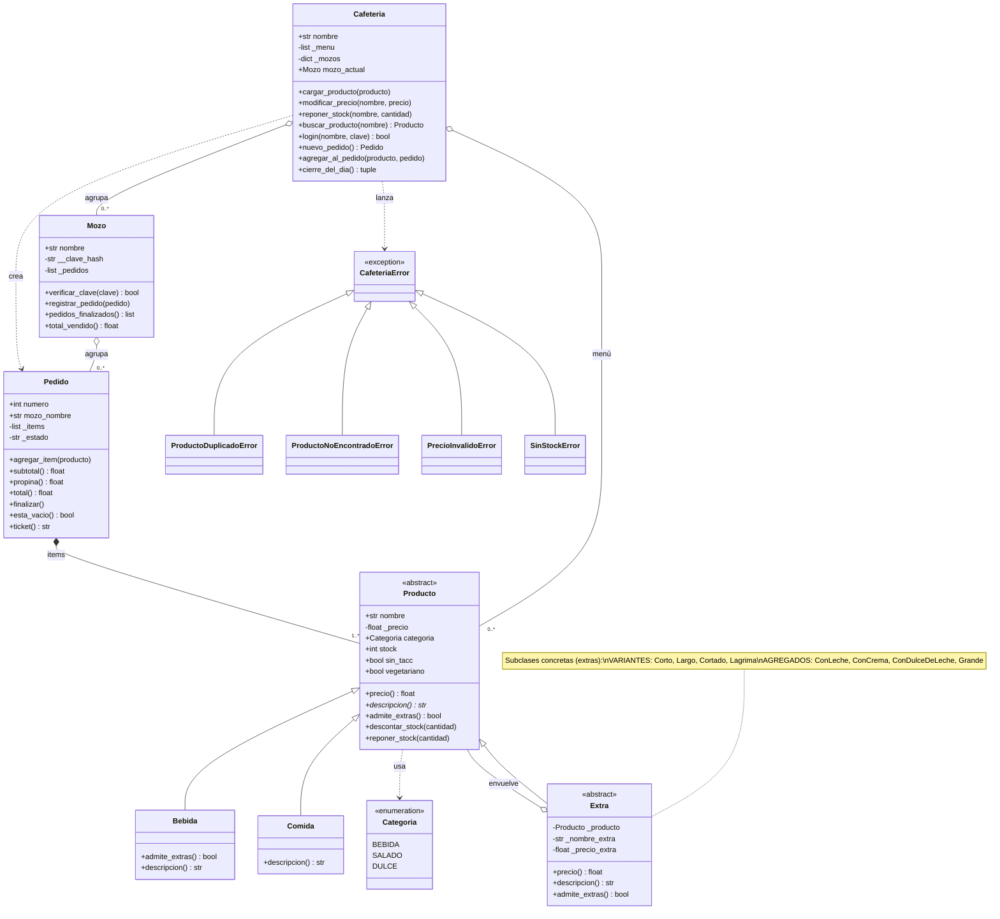

# Simulador de Pedidos de Cafetería

Trabajo Práctico Integrador (TPI) — Programación Avanzada 2026

Aplicación de consola que simula la gestión de pedidos de una cafetería durante
una jornada de trabajo. Es la herramienta interna que usa el **mozo** para
registrar lo que pide cada cliente, calcular el total con propina y emitir el
ticket; y que usa el **gerente** para administrar el menú, el stock y consultar
el cierre del día.

> El cliente no es usuario del sistema: pide de palabra y el mozo opera el
> programa. Por eso los actores son **Mozo** y **Gerente**.

---

## Objetivo

Demostrar la aplicación de los conceptos de Programación Orientada a Objetos,
Diseño Orientado a Objetos y patrones de diseño, priorizando la claridad del
diseño por sobre la cantidad de funcionalidades.

## Funcionalidades

- Inicio de sesión de mozos (nombre + clave común simple).
- Menú organizado por categorías (Bebidas, Salado, Dulce), con precio y stock.
- Banderas informativas por producto: *sin TACC* y *vegetariano*.
- Toma de pedidos con cálculo de total en vivo y **propina automática del 10%**.
- **Extras** para bebidas mediante el **patrón Decorator**, en dos grupos:
  *variantes de preparación* (corto, largo, cortado, lágrima) y *agregados*
  (leche, crema, dulce de leche, tamaño grande). Ejemplo: el cliente pide "un
  cortado con crema" → el mozo arma Café → cortado → crema, y el precio se
  acumula.
- Control de **stock**: se descuenta al vender y no permite vender productos
  agotados (decorador de función `@verificar_stock`).
- Administración del menú por el gerente: modificar precios, reponer stock,
  ver productos agotados, ver valor total del inventario y **cargar productos
  nuevos** (ej: sumar "Café helado" si se pone de moda).
- **Validación y excepciones personalizadas**: no permite cargar productos
  duplicados (mismo nombre y categoría) ni precios negativos; los errores se
  señalizan con excepciones propias (`ProductoDuplicadoError`, etc.).
- **Cierre del día**: consolida las ventas finalizadas de todos los mozos.

---

## Conceptos de POO aplicados

| Concepto | Dónde |
|---|---|
| **Abstracción** | `Producto` es una clase abstracta (`ABC`) con método abstracto `descripcion()`. |
| **Herencia** | `Bebida` y `Comida` heredan de `Producto`. |
| **Polimorfismo** | Cada producto (y cada `Extra`) resuelve `precio` y `descripcion()` a su manera; el `Pedido` los recorre sin conocer el tipo concreto. |
| **Encapsulamiento** | La clave del mozo se guarda **hasheada (SHA-256)** en un atributo privado (`__clave_hash`), nunca en texto plano; el precio se expone con `@property` de solo lectura. |
| **Relación entre objetos** | Agregación: la `Cafetería` agrupa `Mozos`; cada `Mozo` agrupa sus `Pedidos`. |

## Patrones y decoradores

Este proyecto usa **dos cosas distintas que comparten el nombre "decorador"**,
a propósito, para demostrar que se entiende la diferencia:

1. **Patrón de diseño Decorator (GoF)** — estructural, implementado con
   **clases** en `modelos/extra.py`. La clase `Extra` envuelve un `Producto` y
   le suma precio y descripción. Permite combinar extras (Café → con leche →
   grande) sin crear una clase por cada combinación.

2. **Decoradores de función de Python** (la sintaxis `@`) — en
   `decoradores/validaciones.py`. `@verificar_stock` envuelve la acción de
   agregar un producto y la frena si no hay stock; `@requiere_login` controla
   que haya una sesión iniciada. Son una herramienta del lenguaje, **no** el
   patrón de diseño.

---

## Estructura del proyecto

```
simulador-cafeteria/
├── main.py                  # Interfaz de consola (orquesta, sin lógica de negocio)
├── modelos/                 # Dominio del negocio
│   ├── producto.py          # Producto (abstracta), Bebida, Comida
│   ├── extra.py             # Patrón Decorator (Extra y extras concretos)
│   ├── pedido.py            # Pedido: items, subtotal, propina, total, estado
│   ├── mozo.py              # Mozo: login, sus pedidos
│   ├── excepciones.py       # Excepciones personalizadas del dominio
│   └── cafeteria.py         # Cafetería/Gerente: menú, stock, mozos, cierre
├── decoradores/
│   └── validaciones.py      # @verificar_stock, @requiere_login
└── utils/
    ├── categorias.py        # Enum de categorías
    └── datos_iniciales.py   # Menú realista y mozos de ejemplo
```

## Diagrama de clases (UML)



## Cómo ejecutar

Requiere Python 3.10 o superior. No usa librerías externas.

```bash
python main.py
```

### Datos de prueba ya cargados

- **Mozos:** Carlos, María, José — **clave:** `1234`
- **Menú:** 15 productos repartidos en Bebidas, Salado y Dulce.

### Flujo sugerido para la demostración

1. Menú principal → *Ingresar como Mozo* → Carlos / `1234`.
2. *Tomar nuevo pedido* → elegir un café → agregar extra *leche* → *Tamaño
   grande* → finalizar y ver el ticket con la propina.
3. Volver al menú principal → *Administrar menú* → reponer stock / modificar
   precio.
4. Menú principal → *Ver cierre del día* → ver las ventas consolidadas.

---

## Integrantes

| Nombre | DNI |
|---|---|
| Aldana Benavent | 34.175.035 |
| Emiliano Maydana | 46.108.946 |
| Luciano Gabriel Zenobio | 44.598.717 |
| Miguel Di Dio | 44.710.442 |

## Materia

Programación Avanzada — 2026
| **Encapsulamiento** | La clave del mozo se guarda **hasheada (SHA-256)** en un atributo privado (`__clave_hash`), nunca en texto plano; el precio se expone con `@property` de solo lectura. |
| **Relación entre objetos** | Agregación: la `Cafetería` agrupa `Mozos`; cada `Mozo` agrupa sus `Pedidos`. |

## Patrones y decoradores

Este proyecto usa **dos cosas distintas que comparten el nombre "decorador"**,
a propósito, para demostrar que se entiende la diferencia:

1. **Patrón de diseño Decorator (GoF)** — estructural, implementado con
   **clases** en `modelos/extra.py`. La clase `Extra` envuelve un `Producto` y
   le suma precio y descripción. Permite combinar extras (Café → con leche →
   grande) sin crear una clase por cada combinación.

2. **Decoradores de función de Python** (la sintaxis `@`) — en
   `decoradores/validaciones.py`. `@verificar_stock` envuelve la acción de
   agregar un producto y la frena si no hay stock; `@requiere_login` controla
   que haya una sesión iniciada. Son una herramienta del lenguaje, **no** el
   patrón de diseño.

---

## Estructura del proyecto

```
simulador-cafeteria/
├── main.py                  # Interfaz de consola (orquesta, sin lógica de negocio)
├── modelos/                 # Dominio del negocio
│   ├── producto.py          # Producto (abstracta), Bebida, Comida
│   ├── extra.py             # Patrón Decorator (Extra y extras concretos)
│   ├── pedido.py            # Pedido: items, subtotal, propina, total, estado
│   ├── mozo.py              # Mozo: login, sus pedidos
│   └── cafeteria.py         # Cafetería/Gerente: menú, stock, mozos, cierre
├── decoradores/
│   └── validaciones.py      # @verificar_stock, @requiere_login
└── utils/
    ├── categorias.py        # Enum de categorías
    └── datos_iniciales.py   # Menú realista y mozos de ejemplo
```

## Cómo ejecutar

Requiere Python 3.10 o superior. No usa librerías externas.

```bash
python main.py
```

### Datos de prueba ya cargados

- **Mozos:** Carlos, María, José — **clave:** `1234`
- **Menú:** 15 productos repartidos en Bebidas, Salado y Dulce.

### Flujo sugerido para la demostración

1. Menú principal → *Ingresar como Mozo* → Carlos / `1234`.
2. *Tomar nuevo pedido* → elegir un café → agregar extra *leche* → *Tamaño
   grande* → finalizar y ver el ticket con la propina.
3. Volver al menú principal → *Administrar menú* → reponer stock / modificar
   precio.
4. Menú principal → *Ver cierre del día* → ver las ventas consolidadas.

---

## Integrantes

| Nombre | DNI |
|---|---|
| Aldana Benavent | 34.175.035 |
| Emiliano Maydana | 46.108.946 |
| Luciano Gabriel Zenobio | 44.598.717 |
| Miguel Di Dio | 44.710.442 |

## Materia

Programación Avanzada — 2026
